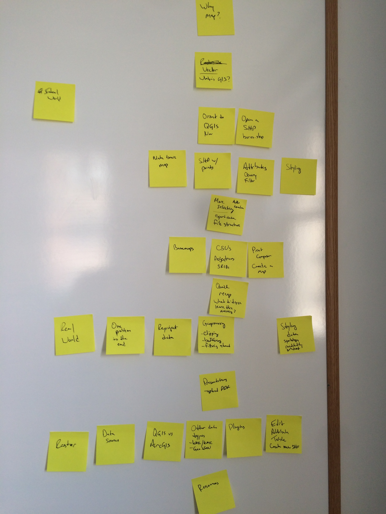

A class in basic fundamentals of GIS using [QGIS](http://www.qgis.org/). 

Slides are available [here](http://www.datapolitan.com/DOT_GIS/Introduction_to_GIS_Fundamentals).

##Outline for the Class

+ Why map?
+ What is GIS?
+ Orientation to QGIS
    + Open a shapefile (boroughs of NYC)
+ Basic operations in QGIS
	+ Make a basic map
	+ Add a shapefile layer with points
	+ Query and filter by attributes
	+ Apply basic styling
+ More operations in QGIS
	+ Select by location
	+ Select by attribute
	+ Export data
	+ Introduction to file structure
+ Creating a better map
	+ Adding base maps in QGIS
	+ Working with CSV data in QGIS
		+ Projections
		+ SRIDs
	+ Using Print Composer to create a map
+ Lunch
+ Recap of morning session
	+ What did you learn this morning?
+ Applying lessons
	+ Reproject data
	+ Geoprocessing
		+ clipping
		+ buffering
		+ advanced filtering
	+ Styling data
		+ symbology
		+ readability
		+ use of gradients
	+ Presentations
		+ Task to participants: Upload a PDF map to the provided URL and discuss your map in class
+ Final topics
	+ Raster data
	+ Data sources
	+ Other data types (KML, GeoJSON)
	+ QGIS vs ArcGIS
	+ Plugins
	+ Edit attribute table
+ Resources
